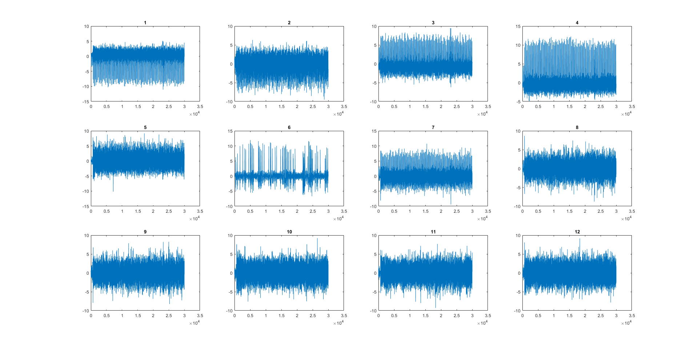

# eegfmri-matlab

This repository contains scripts for cleaning EEG data contaminated with gradient, and ballistocardiogram (BCG) artifacts.

To clean your data, you simply need to run
```
cleaneeg = eegfmri_clean(dirtyeeg, 'output_name.set')
```

While most of the cleaning is automatic, you will be asked to pick a "best" BCG component after the gradient artifact cleaning is done. You will have to pick the component which has the nicest peaks (using the number above the subplot), as well as it's polarity (since the peaks can be minimums or maximums).

For example, see the following figure of a set of BCG ICA components.



The BCG component 1 (first requested input from `eegfmri_clean`) has nice peaks, and it has a polarity of -1 (second requested input from `eegfmri_clean`). The BCG component 4 is also nice, and it has a polarity of 1. It's possible that we could automate this, but we find this is a nice trade-off between automation failures, and human intervention.

This code is licensed under GPLv3. Please contact us if you need a different license.
